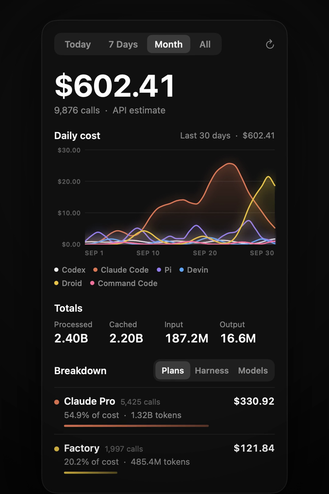

<div align="center">


# Token Ledger

**Know what your AI coding agents actually cost.**

A tiny macOS menu bar app that reads the logs your coding CLIs already write
and shows your token usage and what it would cost at API prices.
Every agent, plan, and model, in one place.

[**Download**](https://github.com/bisheshabramhacharya/token-ledger/releases/latest/download/TokenLedger.zip) · [Watch the demo](docs/demo.mp4) · macOS 14+ · Apple Silicon & Intel · Free and open source

[](https://github.com/bisheshabramhacharya/token-ledger/actions/workflows/build.yml)
[](https://github.com/bisheshabramhacharya/token-ledger/releases/latest)



</div>

## Install

Paste this in Terminal:

```sh
curl -fsSL https://raw.githubusercontent.com/bisheshabramhacharya/token-ledger/main/install.sh | sh
```

It downloads the latest release into `/Applications` and opens it. Look for the icon in your menu bar.
To update later, run the same command again.

<details>
<summary>Prefer to download it yourself?</summary>

1. Download [TokenLedger.zip](https://github.com/bisheshabramhacharya/token-ledger/releases/latest/download/TokenLedger.zip) and unzip it.
2. Drag **TokenLedger.app** into Applications.
3. The app isn't notarized by Apple, so the first launch is blocked. Open **System Settings → Privacy & Security**, scroll down, and click **Open Anyway**.
   Or run `xattr -dr com.apple.quarantine /Applications/TokenLedger.app` once.

</details>

Turn on **Open at login** at the bottom of the panel and you're done.

## Supported agents

There is nothing to connect. If you use any of these, Token Ledger finds their logs automatically.

| Agent | Where it reads from |
| --- | --- |
| Claude Code | `~/.claude/projects`, `~/.config/claude/projects` |
| Codex CLI | `~/.codex/sessions`, `~/.codex/archived_sessions` |
| Droid (Factory) | `~/.factory/sessions` |
| Pi | `~/.pi/agent/sessions` |
| Devin CLI | `~/.local/share/devin/cli/sessions.db` |
| Command Code | `~/.commandcode/projects` |

## What you get

- **Total cost** for today, the last 7 days, this month, or all time.
- **Daily cost chart**, one line per agent.
- **Totals** for processed, cached, input, and output tokens.
- **Breakdown** by plan, by agent, or by model, with each one's share of the cost.

Costs are estimates at public API prices from [LiteLLM's price list](https://github.com/BerriAI/litellm),
so you can see what your subscription is really worth. Cached tokens are priced at cache rates.
Pi and Command Code log what they actually billed, and those numbers are used as-is.

## Private by design

Your usage never leaves your Mac. Token Ledger only reads local log files, and the only thing it downloads
is the public price list, once a day. No account, no API keys, no telemetry.

## Lightweight

- About a 600 KB download.
- Uses roughly 0% CPU when idle and around 30–45 MB of memory.
- Only re-reads log files that changed, and refreshes every 5 minutes or when you click refresh.

## Customize

Click **Config** in the panel to open `~/Library/Application Support/TokenLedger/config.json`. Changes apply on the next refresh.

```jsonc
{
  // Your monthly subscription prices, shown next to each plan.
  "plans": { "Claude Max": 100, "ChatGPT Plus": 20 },
  // Rename a plan to match yours. Defaults: Claude Pro, ChatGPT Plus, Factory, Devin, Command Code.
  "harnessPlans": { "Claude Code": "Claude Max" },
  // Which plan each Pi provider bills to.
  "piProviderPlans": { "anthropic": "Claude Max", "openai-codex": "ChatGPT Plus" },
  // Prices (USD per million tokens) for models that aren't in the public list.
  "priceOverrides": { "my-model": { "input": 1, "output": 4, "cacheRead": 0.1 } },
  // Plans or providers to leave out of every total.
  "hidden": []
}
```

## Command line

The same numbers are available in Terminal:

```sh
/Applications/TokenLedger.app/Contents/MacOS/TokenLedger --report month   # or today, 7, all
```

## Build from source

Needs Xcode 26 or the matching Swift 6.2 toolchain.

```sh
git clone https://github.com/bisheshabramhacharya/token-ledger.git
cd token-ledger
scripts/bundle.sh             # builds and installs to ~/Applications
scripts/bundle.sh --release   # universal build zipped in build/
```

## Troubleshooting

- **The panel says "No usage in this period".** Check that the agent's folder from the table above exists and has recent sessions. Codex users with a custom `CODEX_HOME` aren't picked up yet.
- **Costs look low or a note says some tokens aren't in the total.** The model isn't in the public price list yet. Add its price under `priceOverrides` in Config.
- **Everything shows $0 on first launch.** The price list couldn't download. It retries on the next refresh, so check your connection and click refresh.
- **Something else?** [Open an issue](https://github.com/bisheshabramhacharya/token-ledger/issues/new/choose). The template asks for exactly what's needed.

## Uninstall

Quit from the panel, then:

```sh
rm -rf /Applications/TokenLedger.app ~/Applications/TokenLedger.app "$HOME/Library/Application Support/TokenLedger"
```

## Notes

- Droid only stores a running total per session, so each Droid session counts on the day it was last active.
- Claude Code deletes logs older than 30 days. Token Ledger keeps what it has already read, so your history survives.

## License

[MIT](LICENSE)
